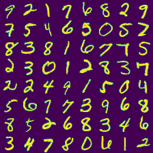
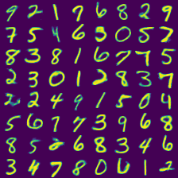

# TensorFlow Implementation of Categorical VAE

## References
- This repository is forked from [@vithursant/VAE-Gumbel-Softmax](https://github.com/vithursant/VAE-Gumbel-Softmax).
    - I think the original code was wrong since `tf.nn.softmax` was applied across wrong dimension.

## Papers
1. [Categorical Reparametrization with Gumbel-Softmax](https://arxiv.org/pdf/1611.01144.pdf) by Maddison, Mnih and Teh
2. [The Concrete Distribution: A Continuous Relaxation of Discrete Random Variables](https://arxiv.org/pdf/1611.00712.pdf) by Jang, Gu and Poole
3. [REBAR: Low-variance, unbiased gradient estimates for discrete latent variable models](https://arxiv.org/pdf/1703.07370.pdf) by Tucker, Mnih, Maddison and Sohl-Dickstein

## MNIST example
| Ground Truths	| Reconstructions 	| Generations    |
|:------------:	|:---------------:	|:----------:   |
| | | |

- NOTE THAT the reconstructions were generated by using ground truths as inputs. 
- I also added generations, where the latent variables are sampled from uniform priors. 